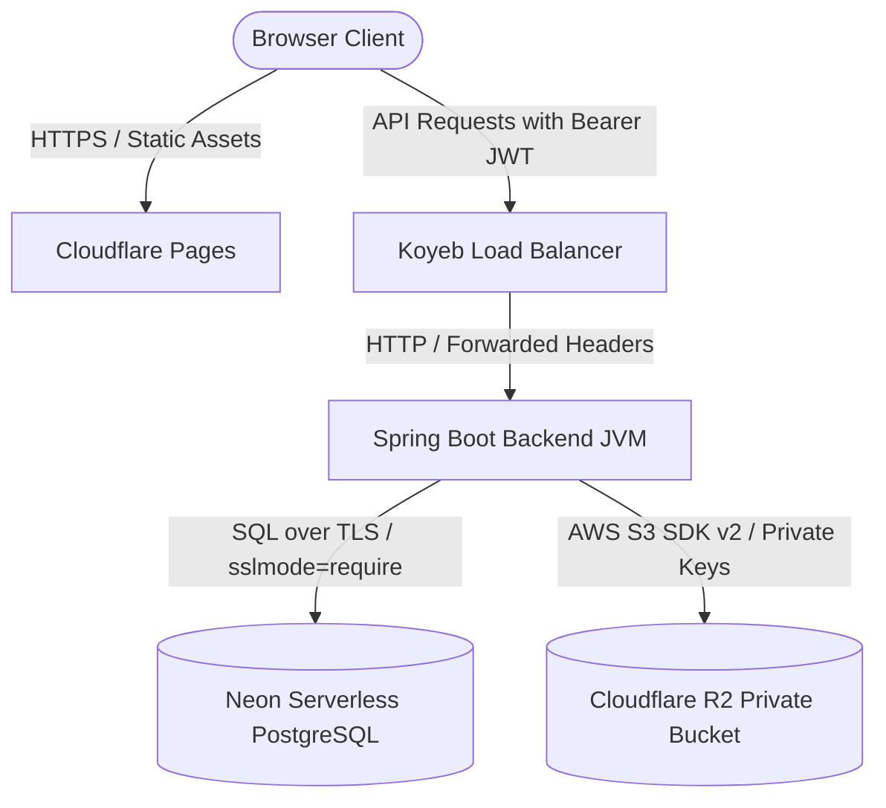

# JobTrack Production Deployment & Security Guide

This document describes the production deployment, security configurations, credentials rotation policies, and operational characteristics of the JobTrack Web application.

---

## 1. System Architecture

The application is structured as a decoupled client-server monorepo:
* **Frontend**: React (TypeScript/Vite) compiled to static files and hosted on **Cloudflare Pages**.
* **Backend**: Spring Boot 3 Java 17 REST API packaged as a Docker image and hosted on **Koyeb**.
* **Database**: Serverless PostgreSQL hosted on **Neon** with TLS enabled (`sslmode=require`).
* **Document Storage**: S3-compatible private cloud object storage hosted on **Cloudflare R2**.



---

## 2. Production Environment Variables Reference

### Backend Settings (Koyeb Environment)

| Variable | Description | Example / Format |
|---|---|---|
| `SPRING_PROFILES_ACTIVE` | Target profile configuration | `prod` |
| `PORT` | HTTP Port matching container mapping | `8080` |
| `SPRING_DATASOURCE_URL` | Neon Database connection URI with TLS | `jdbc:postgresql://<subdomain>.neon.tech/jobtrack_db?sslmode=require` |
| `SPRING_DATASOURCE_USERNAME` | Database username credential | `neondb_owner` |
| `SPRING_DATASOURCE_PASSWORD` | Database password credential | `abc123xyz...` |
| `APP_CORS_ALLOWED_ORIGINS` | Comma-separated allowed frontend origins | `https://jobtrack.pages.dev` |
| `APP_ADMIN_EMAIL` | Initial admin account username (for seeding) | `admin@yourdomain.com` |
| `APP_ADMIN_PASSWORD` | Initial admin account password (for seeding) | `securePassword123` |
| `APP_JWT_SECRET` | Strong, Base64-encoded secret of $\ge$ 256 bits | `dGVzdF9zZWNyZXRfZm9yX2xvY2FsX2RldmVsb3BtZW50X3Nob3VsZF9iZV9hdF9sZWFzdF8yNTZfYml0c19sb25n...` |
| `APP_JWT_EXPIRATION_MINUTES` | Lifetime of issued authentication tokens | `480` |
| `APP_STORAGE_PROVIDER` | Swappable storage configuration | `r2` |
| `R2_ENDPOINT` | Account S3 API URL (R2 Dashboard) | `https://<account-id>.r2.cloudflarestorage.com` |
| `R2_ACCESS_KEY_ID` | Cloudflare API Token Access Key | `abc...` |
| `R2_SECRET_ACCESS_KEY` | Cloudflare API Token Secret Key | `xyz...` |
| `R2_BUCKET_NAME` | Private bucket identifier | `jobtrack-documents` |
| `R2_REGION` | API request region override | `auto` |

### Frontend Settings (Cloudflare Pages Environment)

| Variable | Description | Example / Format |
|---|---|---|
| `VITE_API_URL` | Backend origin for endpoints | `https://jobtrack-backend.koyeb.app` |

---

## 3. Deployment Configuration Details

### Neon (PostgreSQL Database)
1. Provision a new PostgreSQL database.
2. In the connection settings, select the database connection string and ensure it includes `sslmode=require` to enable mandatory TLS encryption.
3. Flyway migrations (`V1` and `V2`) will run automatically on the first backend startup to construct tables.

### Cloudflare R2 (Document Storage)
1. Create a private bucket in the Cloudflare dashboard.
2. Ensure public access is completely disabled. Never enable a public `r2.dev` subdomain.
3. Generate S3-compatible API credentials with `Read/Write` permissions for the bucket.
4. Pass these keys as `R2_ACCESS_KEY_ID` and `R2_SECRET_ACCESS_KEY` to the backend.

### Koyeb (Spring Boot Docker Backend)
1. Link your GitHub repository to Koyeb.
2. Select **Docker Build** and set the path to `/backend` relative to the monorepo root.
3. Configure Koyeb to build from the `Dockerfile` inside `/backend`.
4. Map incoming traffic on port `80` to container port `8080`.
5. Populate all Required Backend variables under the service's Environment settings.
6. **Health check**: Use path `/actuator/health` on port `8080` for Koyeb load-balancer validation.

### Cloudflare Pages (Frontend Build)
1. Link your GitHub repository to Cloudflare Pages.
2. Configure settings:
   - Framework preset: `Vite`
   - Build command: `npm run build`
   - Build output directory: `dist`
   - Root directory: `/frontend`
3. Add the `VITE_API_URL` environment variable pointing to the Koyeb backend origin.

---

## 4. Key Rotation Policies

### JWT Secret Rotation
To cycle `APP_JWT_SECRET`:
1. Generate a new cryptographically secure key of at least 32 bytes and encode it in Base64:
   ```bash
   openssl rand -base64 32
   ```
2. Update `APP_JWT_SECRET` in Koyeb's service configuration.
3. Restart the Koyeb instance. Existing sessions will immediately expire, forcing users to sign in again.

### Database Password Rotation
1. Update the database password on Neon.
2. Update `SPRING_DATASOURCE_PASSWORD` on Koyeb.
3. Re-deploy/restart the Koyeb instance to establish new database connections.

### R2 Storage Key Rotation
1. Generate new API credentials in the Cloudflare console.
2. Update `R2_ACCESS_KEY_ID` and `R2_SECRET_ACCESS_KEY` on Koyeb.
3. Restart the Koyeb instance.
4. Revoke the old credentials in the Cloudflare console.

---

## 5. Operations, Cold Starts & Seeding Notes

### Koyeb Cold Starts
If using Koyeb's free tier, the instance will spin down after inactivity. The first API request will wake the container, which takes around 15–30 seconds. Actuator endpoints help keep the app responsive if pinged regularly.

### Initial Administrator Seeding
- On the first successful startup, the `AdminUserSeeder` checks the database. If the `app_users` table is completely empty, it seeds the default administrator account using the email and password supplied in `APP_ADMIN_EMAIL` and `APP_ADMIN_PASSWORD`.
- **CRITICAL SECURITY NOTE**: Changing `APP_ADMIN_PASSWORD` in the environment variables after this initial startup will **NOT** modify or update the database password. This is to prevent environment configuration values from silently overriding active database credentials. To update the administrator password afterwards, execute a SQL update statement with a BCrypt hash directly on the database.

---

## 6. Troubleshooting

1. **Backend fails to start with "IllegalStateException: Production startup failed: ..."**
   - The validation component `ProductionVariableValidator` checks that all mandatory variables are supplied. Inspect the container logs in Koyeb to identify which variable is missing.

2. **Documents fail to download or throw 401**
   - Verify that the frontend Axios client is injecting the `Authorization: Bearer <token>` header. Verify that the R2 bucket access key has read permissions.

3. **Flyway error: "Migration checksum mismatch"**
   - This occurs if a migration file is modified after it has already run. Do not modify existing `V1` or `V2` files. Instead, create a new migration (`V3__...`) to apply changes.
