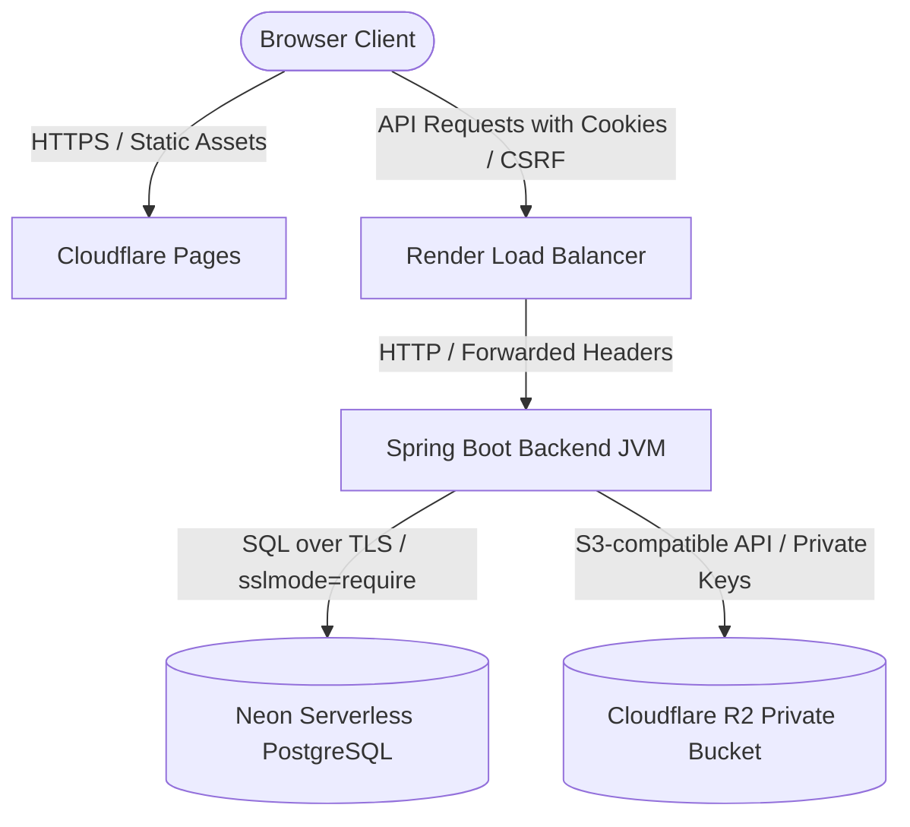

# JobTrack Production Deployment & Security Guide

This document describes the production deployment, security configurations, and operational characteristics of the JobTrack Web application.

---

## 1. System Architecture

The application is structured as a decoupled client-server monorepo:
* **Frontend**: React (TypeScript/Vite) compiled to static files and hosted on **Cloudflare Pages**.
* **Backend**: Spring Boot 3 Java 17 REST API packaged as a Docker image and hosted on **Render** (Docker Web Service).
* **Database**: Serverless PostgreSQL hosted on **Neon** with TLS enabled (`sslmode=require`).
* **Document Storage**: S3-compatible private cloud object storage hosted on **Cloudflare R2**.

---

## 2. Production Environment Variables Reference

### Backend Settings (Render Environment)

| Variable | Description | Example / Format |
|---|---|---|
| `SPRING_PROFILES_ACTIVE` | Target profile configuration | `prod` |
| `PORT` | HTTP Port matching container mapping | `8080` |
| `SPRING_DATASOURCE_URL` | Neon Database connection URI with TLS | `jdbc:postgresql://<subdomain>.neon.tech/jobtrack_db?sslmode=require` |
| `SPRING_DATASOURCE_USERNAME` | Database username credential | `neondb_owner` |
| `SPRING_DATASOURCE_PASSWORD` | Database password credential | `<password>` |
| `APP_CORS_ALLOWED_ORIGINS` | Comma-separated allowed frontend origins | `https://jobapplicationtracker-129.pages.dev` |
| `APP_ADMIN_EMAIL` | Initial admin account email (for seeding; APP_ADMIN_USERNAME is supported as an optional alias) | `admin@yourdomain.com` |
| `APP_ADMIN_PASSWORD` | Initial admin account password (for seeding) | `<password>` |
| `APP_DEMO_USERNAME` | Demo account username (optional, defaults to `demo`) | `demo` |
| `APP_DEMO_PASSWORD` | Demo account password (optional, demo seeder runs in production only if provided) | `<password>` |
| `APP_STORAGE_PROVIDER` | Swappable storage configuration | `r2` |
| `R2_ENDPOINT` | Account S3 API URL (R2 Dashboard) | `https://<account-id>.r2.cloudflarestorage.com` |
| `R2_ACCESS_KEY_ID` | Cloudflare API Token Access Key | `<access-key>` |
| `R2_SECRET_ACCESS_KEY` | Cloudflare API Token Secret Key | `<secret-key>` |
| `R2_BUCKET_NAME` | Private bucket identifier | `jobtrack-documents` |
| `R2_REGION` | API request region override | `auto` |
| `JAVA_TOOL_OPTIONS` | JVM optimization overrides for Render container | `-Xms64m -Xmx256m -XX:+UseSerialGC` |

### Frontend Settings (Cloudflare Pages Environment)

| Variable | Description | Example / Format |
|---|---|---|
| `VITE_API_URL` | Backend origin for endpoints | `https://jobtrack-api-eofg.onrender.com` |

---

## 3. Session and CSRF Lifecycle Configuration

The application uses **Spring Security Session-based authentication** (no JWTs) with strict cross-origin cookie rules and CSRF protection.

### Production Session Cookies
The production profile configuration enforces the following security attributes on session cookies (`JSESSIONID`):
- `server.servlet.session.cookie.http-only=true`: Restricts access from JavaScript.
- `server.servlet.session.cookie.secure=true`: Requires HTTPS context.
- `server.servlet.session.cookie.same-site=None`: Allows cookie transport across different registrable domains (Pages to Render).
- `server.forward-headers-strategy=framework`: Instructs Spring Boot to recognize forwarded HTTPS headers (`X-Forwarded-Proto`) sent by the Render load balancer.

### CSRF Token Security
The application implements standard Spring Security CSRF protection using `HttpSessionCsrfTokenRepository` to protect authenticated write requests (`POST`, `PUT`, `PATCH`, `DELETE`).
- **Token Retrieval**: The client calls GET `/api/auth/csrf` (using `withCredentials: true`) to retrieve the session's token and header name (`X-CSRF-TOKEN`) in a JSON response.
- **Login Rotation**: Upon successful login, Spring Security rotates the session to prevent session fixation attacks. The client fetches a new CSRF token associated with the new session.
- **Header Injection**: The client Axios instance appends the token to the header for all state-changing requests.

---

## 4. Deployment Setup Details

### Neon (PostgreSQL Database)
1. Provision a new PostgreSQL database on Neon.
2. Under Connection Settings, copy the connection URI and ensure it includes `sslmode=require` to enforce TLS.
3. Flyway migrations (`V1`, `V2`, `V3`) run automatically on startup to build tables and establish indices.

### Cloudflare R2 (Document Storage)
1. Create a private bucket in the Cloudflare dashboard.
2. Ensure public access is completely disabled. Never enable a public `r2.dev` subdomain.
3. Generate S3-compatible API credentials with `Read/Write` permissions for the bucket.
4. Pass these keys as `R2_ACCESS_KEY_ID` and `R2_SECRET_ACCESS_KEY` to the backend.

### Render (Spring Boot Docker Backend)
1. Set up a new **Web Service** on Render pointing to the GitHub repository.
2. Select **Docker** as the environment and specify the build path.
3. Set the environment variables in the Render Dashboard matching the Reference table.
4. Add the `JAVA_TOOL_OPTIONS` value to optimize JVM memory limits.
5. Render handles load balancing and automatically forwards HTTPS headers.

### Cloudflare Pages (Frontend Build)
1. Create a new Pages Project linked to the GitHub repository.
2. Configure build settings:
   - Framework preset: `Vite`
   - Build command: `npm run build`
   - Build output directory: `dist`
   - Root directory: `/frontend`
3. Add the `VITE_API_URL` environment variable pointing to the Render backend origin.

---

## 5. Operations & Seeding Notes

### Initial Administrator Seeding
- On first startup, `AdminUserSeeder` seeds the default administrator account using the credentials supplied in `APP_ADMIN_EMAIL` (or `APP_ADMIN_USERNAME` as fallback/alias) and `APP_ADMIN_PASSWORD`.
- **Note**: Changing `APP_ADMIN_PASSWORD` in the environment variables after the initial run will **NOT** modify or update the database password. This prevents accidental credential resets.

### Troubleshooting
1. **Flyway error: "Migration checksum mismatch"**
   - Do not modify existing `V1` or `V2` migration files. Always create a new migration (`V3__...`) to apply database changes.
2. **Requests fail with 403 Forbidden**
   - Ensure the browser accepts cross-site cookies. If cookies are blocked, the session context and CSRF token verification will fail.
